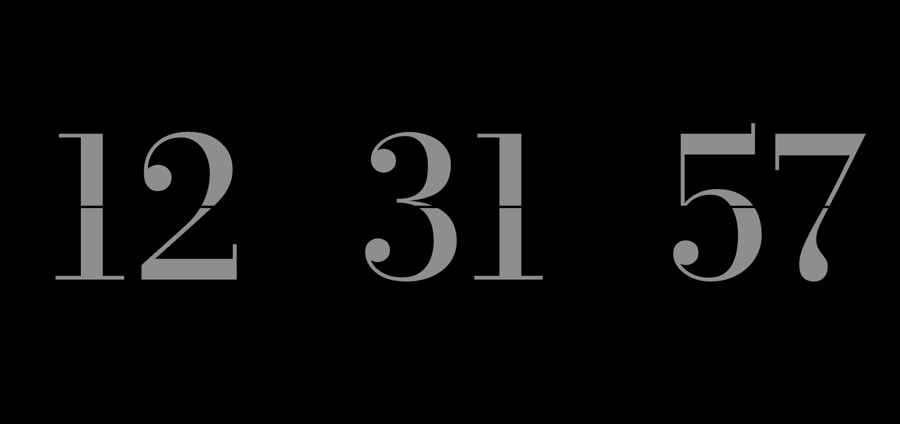

# Clock 

#Live at: https://umutplvn.github.io/Clock/

The purpose of this coding challenge is to get the current time and write it on the screen.

## Expected Outcome

There are variations of functions and some other properties in HTML and CSS.

## Learning Outcomes

At the end of the this coding challenge, students will be able to;

- Analyze a problem, identify and apply programming knowledge for appropriate solution.

- Demonstrate their knowledge of algorithmic design principles by using JavaScript effectively.

### Sample Input

<strong> ⌛ Happy Coding  ✍</strong> 

